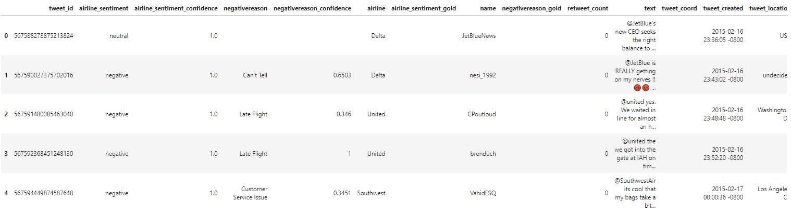

# 
<b>Twitter Posts Classification</b>

## Import our dataset from DataBase

0      567588278875213824           neutral                        1.0000   
1      567590027375702016          negative                        1.0000   
2      567591480085463040          negative                        1.0000   
3      567592368451248130          negative                        1.0000   
4      567594449874587648          negative                        1.0000   
...                   ...               ...                           ...   
14480  570309308937842688           neutral                        0.6869   
14481  570309340952993796           neutral                        1.0000   
14482  570309345281486848          positive                        0.6469   
14483  570310144459972608          negative                        1.0000   
14484  570310600460525568          negative                        0.6292   

                negativereason negativereason_confidence     airline  \
0                                                              Delta   
1                   Can't Tell                    0.6503       Delta   
2                  Late Flight                     0.346      United   
3                  Late Flight                         1      United   
4       Customer Service Issue                    0.3451   Southwest   
...                        ...                       ...         ...   
14480                                                          Delta   
14481                                                     US Airways   
14482                                                          Delta   
14483   Customer Service Issue                         1  US Airways   
14484  Flight Booking Problems                    0.3146  US Airways   

      airline_sentiment_gold             name negativereason_gold  \
0                                 JetBlueNews                       
1                                   nesi_1992                       
2                                   CPoutloud                       
3                                    brenduch                       
4                                    VahidESQ                       
...                      ...              ...                 ...   
14480                         Oneladyyouadore                       
14481                           DebbiMcGinnis                       
14482                                  jaxbra                       
14483                                GAKotsch                       
14484                               jhazelnut                       

       retweet_count                                               text  \
0                  0  @JetBlue's new CEO seeks the right balance to ...   
1                  0  @JetBlue is REALLY getting on my nerves !! 😡😡 ...   
2                  0  @united yes. We waited in line for almost an h...   
3                  0  @united the we got into the gate at IAH on tim...   
4                  0  @SouthwestAir its cool that my bags take a bit...   
...              ...                                                ...   
14480              0  @JetBlue I hope so because I fly very often an...   
14481              0  @USAirways is a DM possible if you aren't foll...   
14482              0  @JetBlue Yesterday on my way from EWR to FLL j...   
14483              0  @USAirways and when will one of these agents b...   
14484              0  @USAirways  is there a better time to call? My...   

      tweet_coord              tweet_created      tweet_location  \
0                  2015-02-16 23:36:05 -0800                 USA   
1                  2015-02-16 23:43:02 -0800           undecided   
2                  2015-02-16 23:48:48 -0800      Washington, DC   
3                  2015-02-16 23:52:20 -0800                       
4                  2015-02-17 00:00:36 -0800     Los Angeles, CA   
...           ...                        ...                 ...   
14480              2015-02-24 11:48:29 -0800             Georgia   
14481              2015-02-24 11:48:37 -0800           Missourah   
14482              2015-02-24 11:48:38 -0800  east brunswick, nj   
14483              2015-02-24 11:51:48 -0800                       
14484              2015-02-24 11:53:37 -0800                       

                    user_timezone  
0                          Sydney  
1      Pacific Time (US & Canada)  
2                                  
3                    Buenos Aires  
4      Pacific Time (US & Canada)  
...                           ...  
14480                       Quito  
14481                      Hawaii  
14482      Atlantic Time (Canada)  
14483      Atlantic Time (Canada)  
14484                              
### Create bar-plot visualization on our datset

