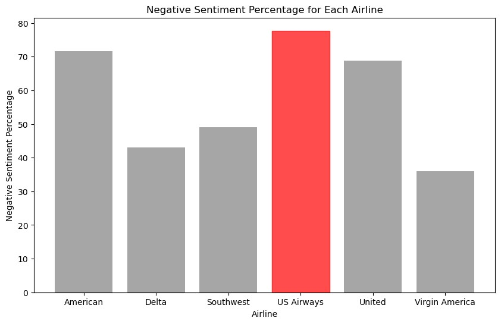

# 
<b>Patents-per-year-prediction</b>

### Import dataset from database

| tweet_id           | airline_sentiment | airline_sentiment_confidence | negativereason         | negativereason_confidence | airline   | airline_sentiment_gold | name        | negativereason_gold | retweet_count | text                                                                                                                                       | tweet_coord | tweet_created              | tweet_location    | user_timezone               |
|-------------------:|:------------------:|-----------------------------:|:-----------------------|:--------------------------:|:---------:|:------------------------:|:------------:|:---------------------:|--------------:|:-------------------------------------------------------------------------------------------------------------------------------------------:|:-----------:|:---------------------------:|:------------------:|:----------------------------:|
| 567588278875213824 | neutral            |                            1 |                        |                           |   Delta   |                          | JetBlueNews |                       |             0 | @JetBlue's new CEO seeks the right balance to please passengers and Wall ... - Greenfield Daily Reporter http://t.co/LM3opxkxch              |             | 2015-02-16 23:36:05 -0800 | USA               | Sydney                      |
| 567590027375702016 | negative           |                            1 | Can't Tell             |                        0.6503 |   Delta   |                          | nesi_1992   |                       |             0 | @JetBlue is REALLY getting on my nerves !! 😡😡 #nothappy                                                                                  |             | 2015-02-16 23:43:02 -0800 | undecided         | Pacific Time (US & Canada) |
| 567591480085463040 | negative           |                            1 | Late Flight            |                     0.346   |  United   |                          | CPoutloud   |                       |             0 | @united yes. We waited in line for almost an hour to do so. Some passengers just left not wanting to wait past 1am.                        |             | 2015-02-16 23:48:48 -0800 | Washington, DC    |                              |
| 567592368451248130 | negative           |                            1 | Late Flight            |                            1 |  United   |                          | brenduch    |                       |             0 | @united the we got into the gate at IAH on time and have given our seats and closed the flight. If you know people is arriving, have to wait |             | 2015-02-16 23:52:20 -0800 |                  | Buenos Aires                |
| 567594449874587648 | negative           |                            1 | Customer Service Issue |                        0.3451 | Southwest |                          | VahidESQ    |                       |             0 | @SouthwestAir its cool that my bags take a bit longer, dont give me baggage blue balls-turn the carousel on, tell me it's coming, then not.  |             | 2015-02-17 00:00:36 -0800 | Los Angeles, CA   | Pacific Time (US & Canada) |

